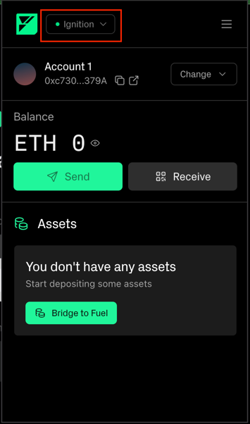
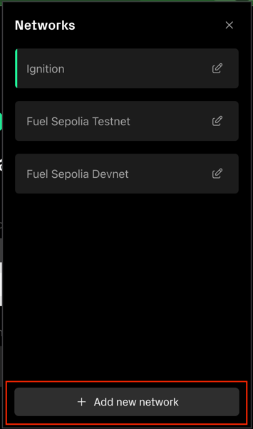
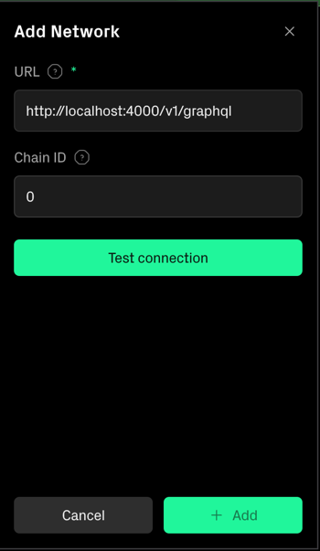
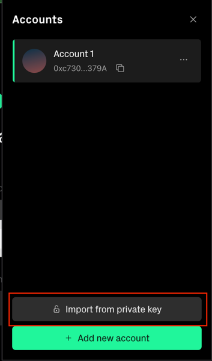
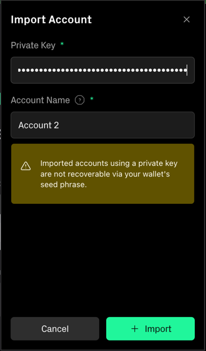

# Wallet Setup

## Connect in Local Node

- Open the Fuel Wallet

- Click on the network selector

  

- Click in "+ Add new network" button

  

- Fill in the form the following values:
    - **URL**: http://localhost:4000/v1/graphql
    - **Chain ID**: 0

   

- Click in "Test connection" button and then "+ Add"

## Import the genesis account to the Fuel Wallet

- Click in "Change" on the top right corner

- In the "Account" tab, click in "Import from private key"

   

- Fill in the form with the following values:
    - **Private Key**: 0xa449b1ffee0e2205fa924c6740cc48b3b473aa28587df6dab12abc245d1f5298

   

- Click in "+ Import".